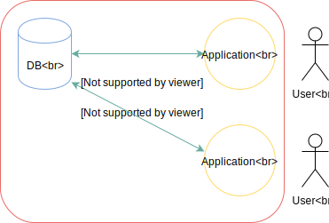

:toc:
:toclevels: 2
:sectnums:

= 第6回 応用情報技術者講義 データベース実践

筆者環境::
- Windows 10 Home
- PostgreSQL 10.4
- Visual Studio 2017 Community

// TODO 挨拶の追加と、レクチャーの範囲を明示

- データベースを作成
- テーブルを複数定義
- 各テーブルを関連付け
- データの入力（マスタ、トランザクション）

== CLIでデータベースを作ってみよう

=== データベースの作成

```SQL
CREATE DATABASE sample;
```

=== テーブルの作成

```SQL
CREATE TABLE workers
(worker_id CHAR(5) NOT NULL, 
worker_name VARCHAR(50) NOT NULL,
work_start_date DATE,
PRIMARY KEY (worker_id));　-- 文の最後に必ずセミコロンを置く
```

NOT NULL制約::
NULL（ヌル）は無記入の状態を表す。つまりNOT NULL制約とは、無記入を許可しないというルールのこと。

CHAR（キャラ）型::
固定長文字列。固定長より短い文字列を入力した場合、半角スペースで埋められる。

VARCHAR（バーキャラ）型::
可変長文字列。


TIP: SQLでは「--」を使うことでコメントを入力できる。複数行にまたがってコメントアウトしたい場合は、「/* */」を使う。

=== データの登録

```SQL
BEGIN TRANSACTION;

INSERT INTO workers VALUES ('00001', '佐藤太郎', '2008-08-15');
INSERT INTO workers VALUES ('00002', '鈴木仁', '2008-09-20');
INSERT INTO workers VALUES ('00003', '伊藤セニョリータ', '2015-03-12');

COMMIT;
```


== VB.NETからPostgreSQLデータベースに接続する

=== データベースとアプリケーションの関係

RDBへはSQLを使ってアクセスする。しかし、SQLとRDBのもつ機能だけでは複雑な処理（ビジネスロジック）に対応できない。

そこで、別のアプリケーションを作って、それ越しにデータベースに接続する方法がとられる。


